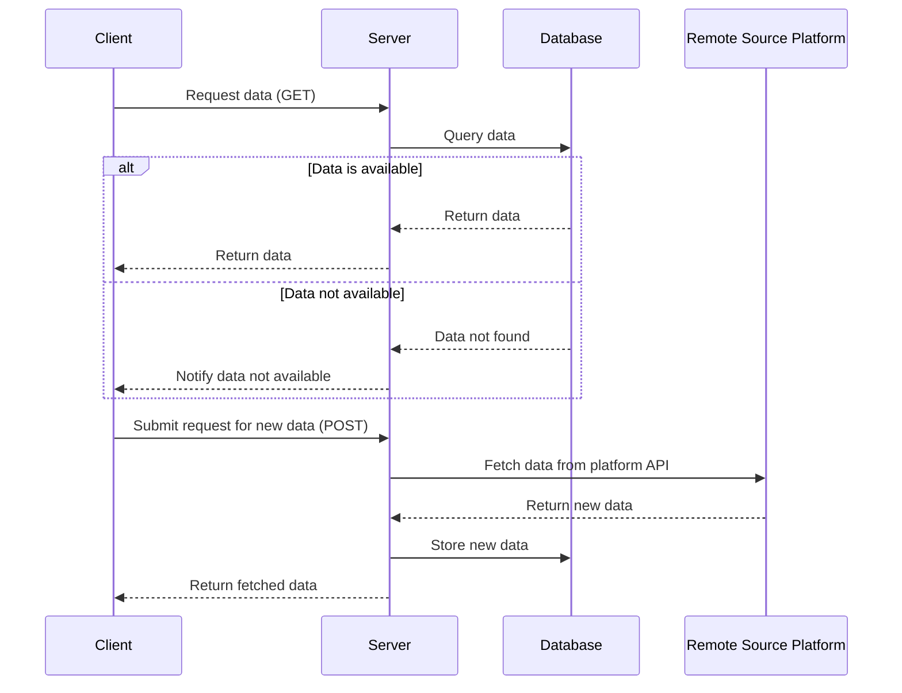

# Nuxt Crypto Info Example

Простой и гибкий проект на Nuxt.js для отображения истории цен криптовалют, таких как Bitcoin к USD. Позволяет выбирать разные платформы для получения данных, делать запросы за криптовалютами и отображать интерактивные графики.

---

## Возможности

- Отображение истории цен криптовалют с визуализацией на графиках
- Поддержка выбора различных платформ (например, бирж) для получения данных
- Гибкое и простое добавление новых платформ без изменения базового кода
- Хранение данных в базе PostgreSQL (через Docker)

